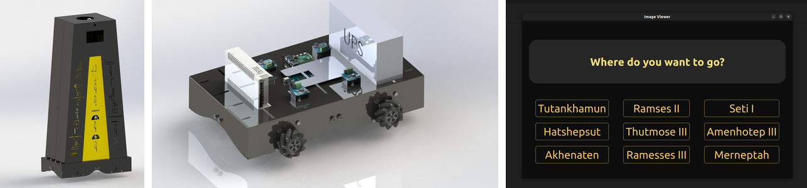

# Mecanum tour-guide robot (ROS 2)

Software for a museum tour-guide robot on a four-wheel mecanum base. B.Sc. graduation project at Cairo University (2023, team of 5, graded A+).



Left to right: the robot's body (team CAD), the mecanum drive base with its electronics (CAD), and the visitor touchscreen app from `mecanumbot_GUI`.

This repository is a fork of [deborggraever/ros2-mecanum-bot](https://github.com/deborggraever/ros2-mecanum-bot). The upstream template provided the package layout and the mecanum drive controller; the changes below are ours.

## What this fork adds

- **Hardware interface.** `mecanumbot_hardware` rewritten as a `ros2_control` `SystemInterface` that talks to an Arduino Mega over serial (LibSerial): wheel velocity commands go out, encoder counts come back, and the wheel PID gains are set from the URDF.
- **Odometry.** `mecanumbot_odometry` integrates the four wheel encoders with mecanum kinematics and publishes `nav_msgs/Odometry`.
- **Robot description and simulation.** URDF updated for our chassis, plus Gazebo launch files and an obstacle world for testing without hardware.
- **Teleop and bring-up.** Teleop configuration and launch files for hardware tests.
- **Visitor GUI.** A PyQt5 touchscreen app (`mecanumbot_GUI`) with voice prompts and speech input.

## Status

Drive, odometry and teleop ran on the real robot (Raspberry Pi 4, Arduino Mega, wheel encoders). SLAM and Nav2 with a Kinect were planned but not finished before the project deadline.

## Build and run

Tested on Ubuntu 22.04 with ROS 2 Humble.

```bash
mkdir -p ~/ws/src && cd ~/ws/src
git clone https://github.com/Negm2000/ros2-mecanum-bot.git
cd ~/ws
rosdep install --from-paths src --ignore-src -r -y
colcon build
source install/setup.bash
ros2 launch mecanumbot_bringup mecanumbot_hardware.py   # real robot
ros2 launch mecanumbot_bringup mecanumbot_gazebo.py     # simulation
```
